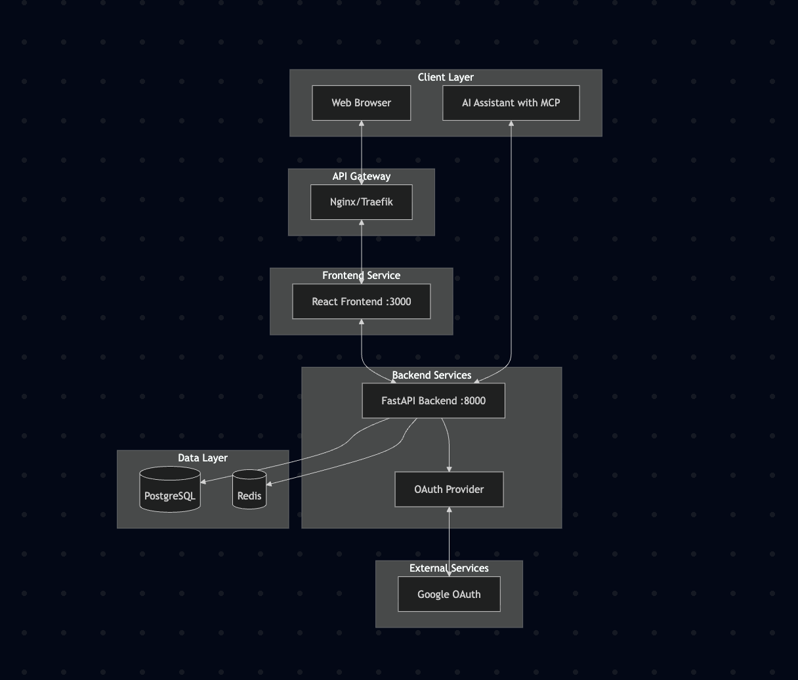
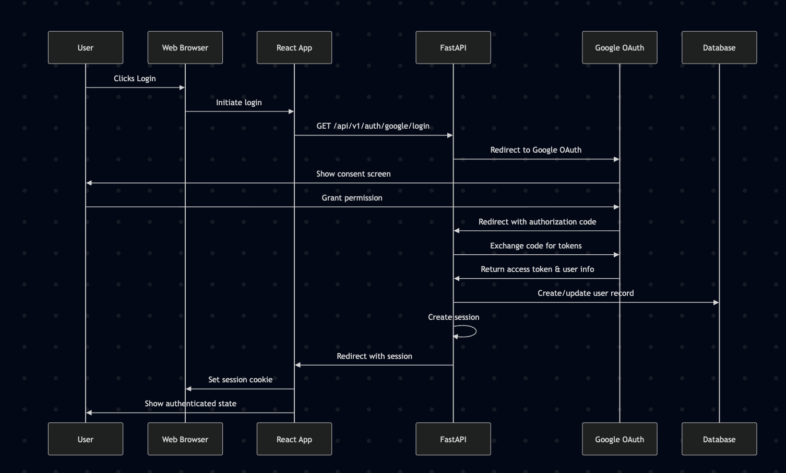
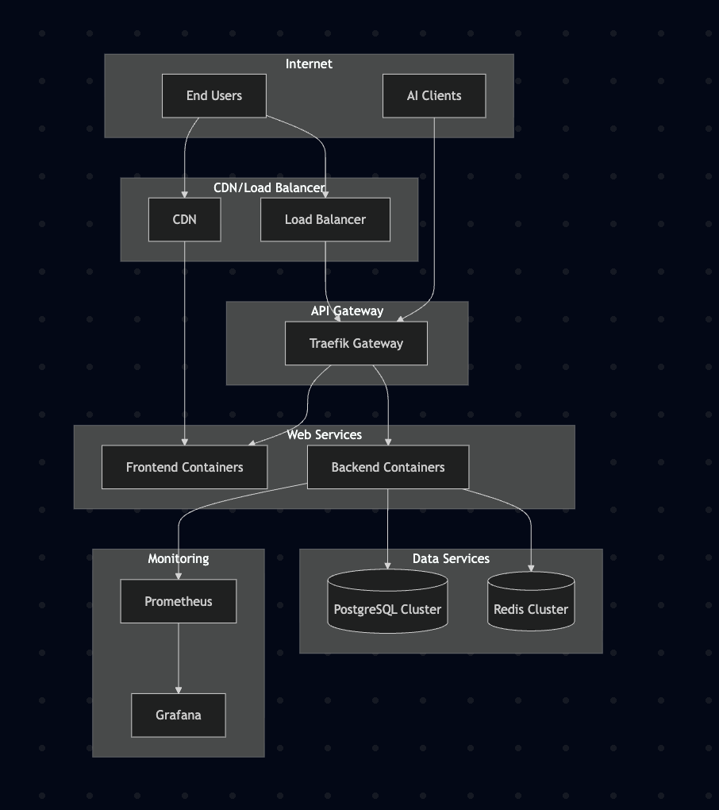

# Yata - Todo App

A simple todo application built with Python FastAPI backend, React TypeScript frontend, and Google OAuth authentication.

## Tech Stack

- **Backend**: Python with FastAPI
- **Frontend**: React with TypeScript, managed by Bun
- **Database**: PostgreSQL for data persistence
- **Cache/Session**: Redis for session management
- **Authentication**: Google OAuth 2.0
- **Development Environment**: Docker Compose
- **MCP Server**: Model Context Protocol server for AI integration

## Architecture

### System Architecture



The Yata application follows a modern microservices architecture with clear separation between frontend, backend, and data layers. The system supports both web browser interactions and AI assistant integration through the MCP (Model Context Protocol) server.

### Authentication Flow



The authentication process uses Google OAuth 2.0 to securely authenticate users. The flow begins when a user clicks the login button, redirects to Google for authentication, and completes with a session being established in the backend.

### Development Environment

The development environment uses Docker Compose to orchestrate all services. Each component runs in its own container with hot-reload enabled for rapid development. The MCP server container connects to the backend API for AI assistant integration.

### Production Architecture



The production environment is designed for high availability and scalability. It includes load balancing, SSL termination, monitoring with Prometheus and Grafana, and container orchestration. The architecture supports both web traffic and AI assistant interactions through the MCP server.

### OAuth 2.0 Machine-to-Machine Flow (MCP)

The MCP server uses OAuth 2.0 client credentials flow for machine-to-machine authentication with the Yata API. This allows AI assistants to securely interact with the todo management system without user intervention.

The flow consists of three phases:
1. **Setup Phase**: One-time registration of the MCP server as an OAuth client
2. **Authentication Flow**: Exchange client credentials for access tokens
3. **Todo Operations**: Use access tokens to perform CRUD operations on todos

For more detailed architectural diagrams, see [docs/architecture-diagrams.md](docs/architecture-diagrams.md).

## Prerequisites

- Docker and Docker Compose
- Google OAuth Client ID and Secret

## Setup

1. **Clone the repository**
   ```bash
   git clone <repository-url>
   cd yata
   ```

2. **Set up environment variables**
   ```bash
   cp .env.example .env
   ```
   
   Fill in your Google OAuth credentials in the `.env` file:
   ```
   GOOGLE_CLIENT_ID=your-google-client-id
   GOOGLE_CLIENT_SECRET=your-google-client-secret
   ```

3. **Start the development environment**
   ```bash
   docker-compose -f docker-compose.dev.yml up --build
   ```

4. **Access the application**
   - Frontend: http://localhost:3000
   - Backend API: http://localhost:8000
   - API Documentation: http://localhost:8000/docs

## Google OAuth Setup

1. Go to the [Google Cloud Console](https://console.cloud.google.com/)
2. Create a new project or select an existing one
3. Enable the Google+ API
4. Create OAuth 2.0 credentials
5. Add authorized redirect URI: `http://localhost:3000/auth/callback`
6. Copy the Client ID and Client Secret to your `.env` file

## Project Structure

```
yata/
├── backend/
│   ├── app/
│   │   ├── api/          # API endpoints
│   │   ├── core/         # Core configuration
│   │   ├── models/       # Database models
│   │   ├── schemas/      # Pydantic schemas
│   │   ├── services/     # Business logic
│   │   └── main.py       # FastAPI application
│   ├── requirements.txt
│   └── Dockerfile.dev
├── frontend/
│   ├── src/
│   │   ├── components/   # React components
│   │   ├── services/     # API client
│   │   ├── types/        # TypeScript types
│   │   ├── utils/        # Utility functions
│   │   └── App.tsx       # Main React component
│   ├── package.json
│   └── Dockerfile.dev
├── mcp-yata/             # MCP Server for AI integration
│   ├── mcp_yata/
│   │   ├── server.py     # Main MCP server
│   │   ├── auth.py       # OAuth client
│   │   ├── client.py     # API client
│   │   ├── tools.py      # MCP tools
│   │   └── config.py     # Configuration
│   ├── requirements.txt
│   └── Dockerfile
├── docs/                 # Documentation
│   ├── architecture-diagrams.md
│   └── mcp-*.md
├── docker-compose.dev.yml
├── docker-compose.prod.yml
└── README.md
```

## API Endpoints

### Authentication
- `GET /api/v1/auth/google/login` - Redirect to Google OAuth
- `GET /api/v1/auth/google/callback` - OAuth callback handler
- `POST /api/v1/auth/logout` - Logout user
- `GET /api/v1/auth/me` - Get current user info

### Todos
- `GET /api/v1/todos` - Get all todos for authenticated user
- `POST /api/v1/todos` - Create new todo
- `GET /api/v1/todos/{id}` - Get specific todo
- `PUT /api/v1/todos/{id}` - Update todo
- `DELETE /api/v1/todos/{id}` - Delete todo

### OAuth 2.0 (for MCP)
- `POST /oauth/token` - Get OAuth token for machine-to-machine authentication

## MCP Server Integration

The project includes a Model Context Protocol (MCP) server that enables AI assistants to interact with the Yata API through OAuth 2.0 machine-to-machine authentication.

### Setting up MCP Server

1. Create OAuth credentials for the MCP server:
   ```bash
   # In the backend application
   # Create an OAuth client with client_credentials grant type
   ```

2. Configure MCP server environment variables:
   ```bash
   # In mcp-yata/.env
   OAUTH_CLIENT_ID=your_mcp_client_id
   OAUTH_CLIENT_SECRET=your_mcp_client_secret
   OAUTH_TOKEN_URL=http://backend:8000/oauth/token
   API_BASE_URL=http://backend:8000/api/v1
   ```

3. Start the MCP server:
   ```bash
   python -m mcp_yata.server
   ```

### Available MCP Tools

- `create_todo` - Create a new todo item
- `list_todos` - Get all todos for the authenticated user
- `get_todo` - Get a specific todo by ID
- `update_todo` - Update an existing todo
- `delete_todo` - Delete a todo

For more details on MCP implementation, see [docs/mcp-server-architecture.md](docs/mcp-server-architecture.md).

## Development

### Backend Development
- The backend runs on port 8000 with hot reload enabled
- Database migrations are handled automatically on startup
- API documentation is available at `/docs`

### Frontend Development
- The frontend runs on port 3000 with hot reload enabled
- TypeScript is configured for strict type checking
- Tailwind CSS is used for styling

### Database Management
- PostgreSQL data is persisted in a Docker volume
- Redis is used for session management
- Database schema is created automatically on startup

## Production Deployment

For production deployment, you'll need to:

1. Use production Dockerfiles (not the `.dev` versions)
2. Set up proper environment variables
3. Configure HTTPS
4. Set up a proper database and Redis instance
5. Configure proper CORS settings

## Contributing

1. Fork the repository
2. Create a feature branch
3. Make your changes
4. Test thoroughly
5. Submit a pull request

## License

This project is licensed under the MIT License.