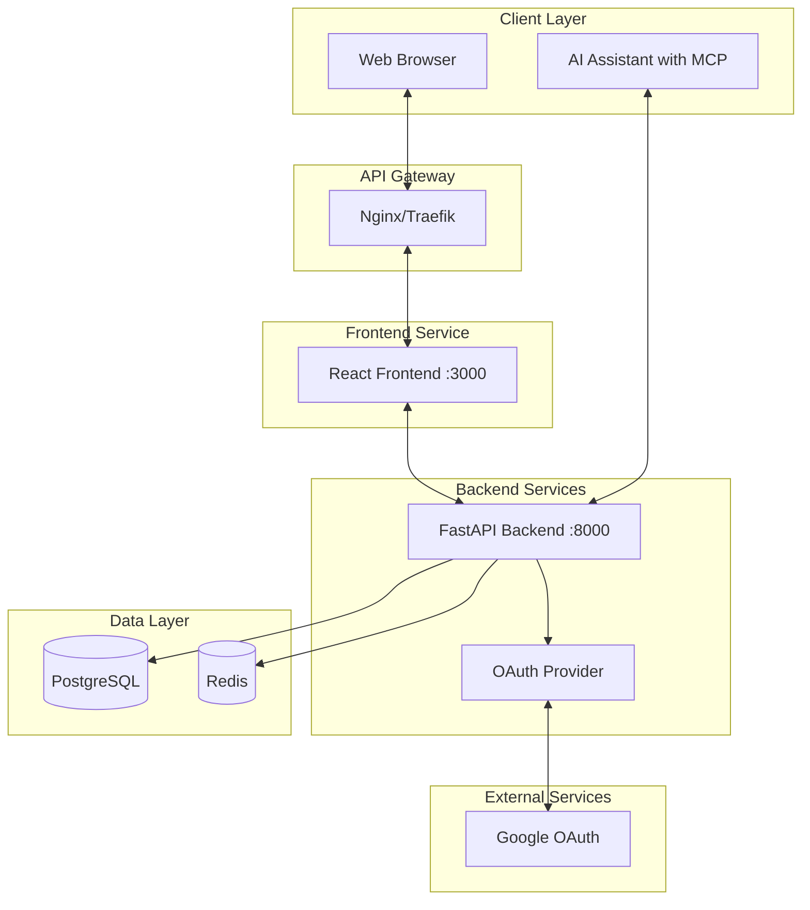
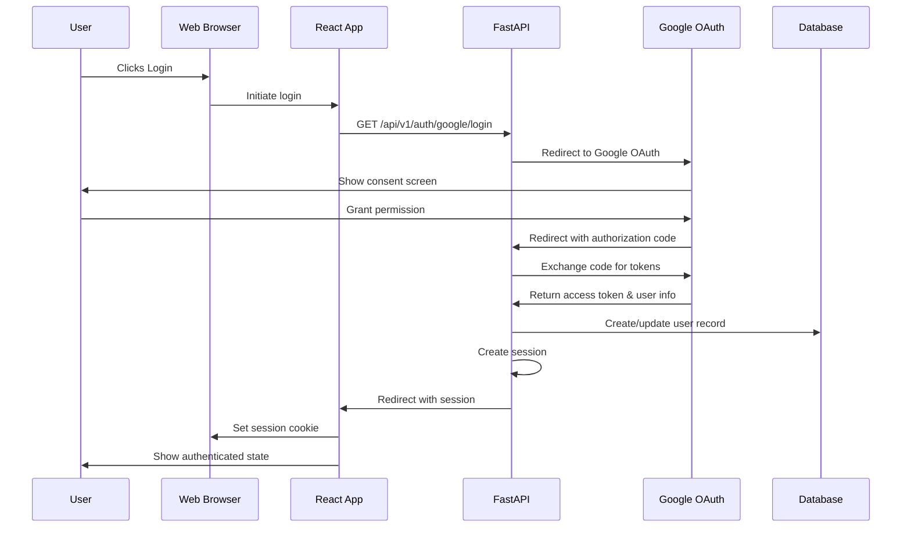
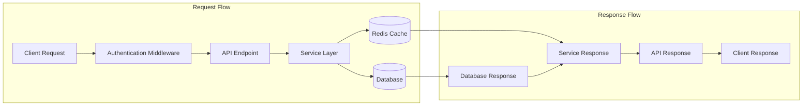
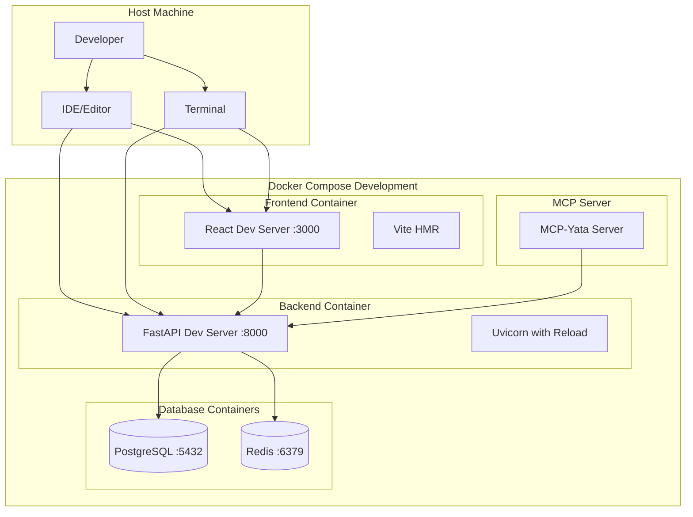
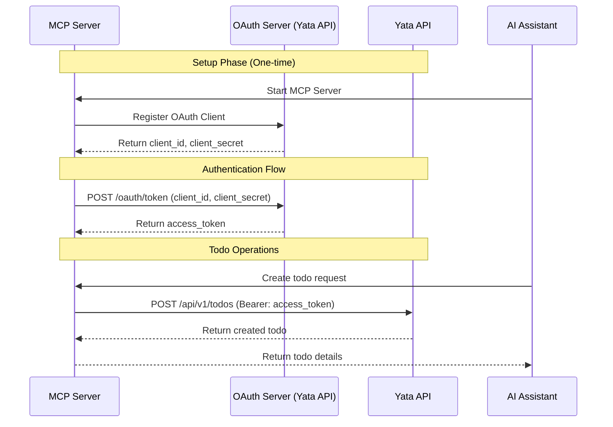

# Architecture Diagrams

## System Architecture



## Authentication Flow



## API Data Flow



## Development Environment



## OAuth 2.0 Machine-to-Machine Flow (MCP)



## Production Architecture

```mermaid
graph TB
    subgraph "Internet"
        USER[End Users]
        AI_CLIENTS[AI Clients]
    end
    
    subgraph "CDN/Load Balancer"
        LB[Load Balancer]
        CDN[CDN]
    end
    
    subgraph "Web Services"
        FE[Frontend Containers]
        BE[Backend Containers]
    end
    
    subgraph "API Gateway"
        GATEWAY[Traefik Gateway]
    end
    
    subgraph "Data Services"
        PG_CLUSTER[(PostgreSQL Cluster)]
        REDIS_CLUSTER[(Redis Cluster)]
    end
    
    subgraph "Monitoring"
        PROMETHEUS[Prometheus]
        GRAFANA[Grafana]
    end
    
    USER --> CDN
    USER --> LB
    LB --> GATEWAY
    CDN --> FE
    GATEWAY --> FE
    GATEWAY --> BE
    AI_CLIENTS --> GATEWAY
    BE --> PG_CLUSTER
    BE --> REDIS_CLUSTER
    BE --> PROMETHEUS
    PROMETHEUS --> GRAFANA