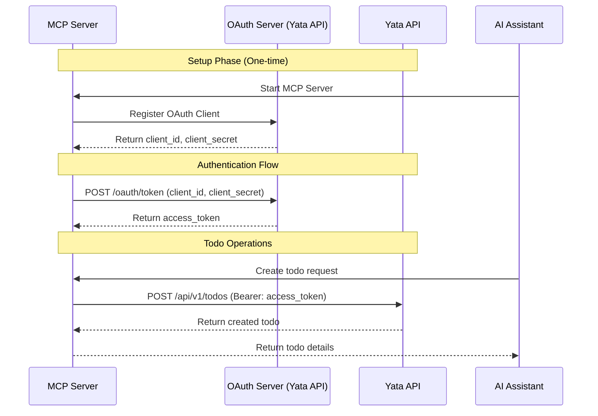
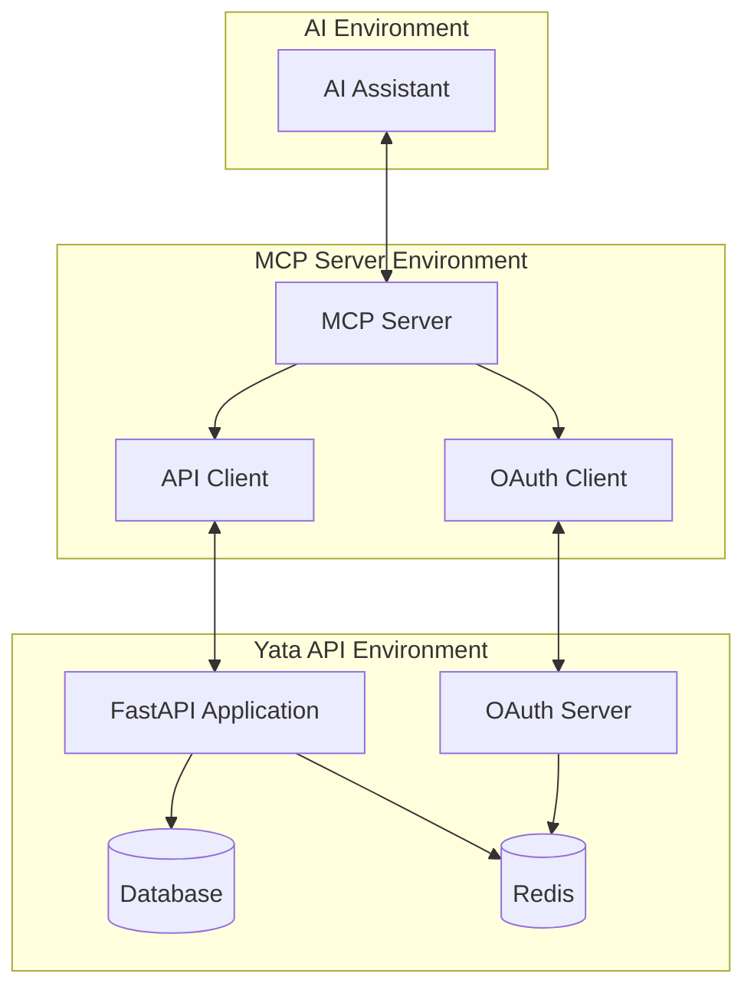

# MCP Server Architecture & OAuth 2.0 Flow

## OAuth 2.0 Machine-to-Machine Flow



## System Architecture



## Data Flow for Todo Operations

### Create Todo Flow
1. AI Assistant sends request to MCP Server
2. MCP Server validates request format
3. MCP Server ensures valid access token (requests new one if needed)
4. MCP Server forwards request to Yata API with Bearer token
5. Yata API validates token and user context
6. Yata API creates todo in database
7. Response flows back through the chain to AI Assistant

### Authentication Details

#### OAuth 2.0 Client Credentials Flow
```
POST /oauth/token
Content-Type: application/x-www-form-urlencoded

grant_type=client_credentials&
client_id=mcp_yata_client&
client_secret=secret&
scope=todos:read todos:write
```

#### Response
```json
{
  "access_token": "eyJhbGciOiJSUzI1NiIsInR5cCI6IkpXVCJ9...",
  "token_type": "Bearer",
  "expires_in": 3600,
  "scope": "todos:read todos:write"
}
```

## MCP Protocol Implementation

### Tool Definition Structure
```json
{
  "name": "create_todo",
  "description": "Create a new todo item",
  "inputSchema": {
    "type": "object",
    "properties": {
      "title": {
        "type": "string",
        "description": "Title of the todo item"
      },
      "description": {
        "type": "string",
        "description": "Optional description of the todo"
      }
    },
    "required": ["title"]
  }
}
```

### Tool Response Structure
```json
{
  "content": [
    {
      "type": "text",
      "text": "Todo created successfully with ID: abc-123"
    }
  ]
}
```

## Security Considerations

### OAuth Token Management
- Access tokens expire after 1 hour
- MCP Server implements token caching and refresh
- Client credentials stored securely as environment variables
- Minimal scopes granted based on required operations

### API Security
- All requests validated with Bearer tokens
- Rate limiting implemented to prevent abuse
- Input validation on all parameters
- Audit logging for all operations

### Network Security
- All communications over HTTPS
- Internal services communicate through Docker networks
- No direct database access from MCP Server
- Sensitive data not logged or cached

## Error Handling Strategy

### Authentication Errors
- Invalid tokens trigger automatic refresh
- Client authentication failures require manual intervention
- Token expiration handled transparently

### API Errors
- Validation errors returned with descriptive messages
- Rate limit responses include retry-after information
- Server errors trigger retry with exponential backoff

### MCP Protocol Errors
- Invalid tool inputs rejected with schema validation
- Missing required parameters clearly indicated
- Tool execution failures include error context