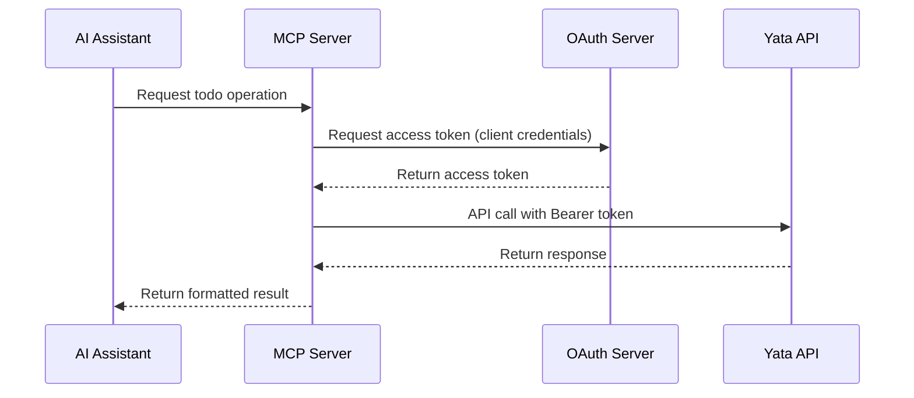

# MCP Server for Yata Todo App - Implementation Summary

## Overview
This document provides a comprehensive plan for implementing a Model Context Protocol (MCP) server that enables AI assistants to interact with the Yata Todo application through secure API calls using OAuth 2.0 machine-to-machine authentication.

## Key Components

### 1. OAuth 2.0 Server (Backend Enhancements)
- **OAuth Client Model**: Stores client credentials and allowed scopes
- **OAuth Token Model**: Manages access tokens with expiration
- **OAuth Service**: Handles client authentication and token generation
- **OAuth Endpoints**: Provides token endpoint for client credentials flow

### 2. MCP Server (Standalone Service)
- **OAuth Client**: Handles authentication with the backend
- **API Client**: Communicates securely with the Yata API
- **MCP Tools**: Implements todo CRUD operations
- **Configuration Management**: Handles environment variables and settings

### 3. Docker & Deployment
- **Containerized MCP Server**: Lightweight Docker image
- **Docker Compose Integration**: Added to existing development environment
- **Environment Configuration**: Secure management of credentials

## Authentication Flow



## MCP Tools Available

1. **create_todo**: Create a new todo item
   - Input: title (required), description (optional), completed (optional)
   - Output: Confirmation with todo ID

2. **list_todos**: Get all todos for the user
   - Input: None
   - Output: Formatted list of todos

3. **get_todo**: Get a specific todo by ID
   - Input: todo_id
   - Output: Todo details

4. **update_todo**: Update an existing todo
   - Input: todo_id, fields to update
   - Output: Updated todo details

5. **delete_todo**: Delete a todo
   - Input: todo_id
   - Output: Confirmation message

## Security Features

### OAuth 2.0 Implementation
- Client credentials flow for machine-to-machine authentication
- Short-lived access tokens (1 hour expiration)
- Scope-based access control (todos:read, todos:write)
- Secure storage of client credentials

### API Security
- Bearer token authentication for all API calls
- Token validation on each request
- Automatic token refresh in MCP server
- Secure communication over HTTPS in production

## File Structure

### Backend Changes
```
backend/
├── app/
│   ├── models/
│   │   ├── oauth_client.py      # OAuth client model
│   │   └── oauth_token.py       # OAuth token model
│   ├── services/
│   │   └── oauth_service.py     # OAuth business logic
│   ├── api/
│   │   ├── v1/
│   │   │   └── oauth.py         # OAuth endpoints
│   │   └── oauth_deps.py        # OAuth dependencies
│   └── core/
│       └── config.py            # Updated configuration
```

### MCP Server
```
mcp-yata/
├── mcp_yata/
│   ├── server.py                # Main MCP server
│   ├── auth.py                  # OAuth client
│   ├── client.py                # API client
│   ├── tools.py                 # MCP tools
│   └── config.py                # Configuration
├── requirements.txt
├── Dockerfile
├── .env.example
└── README.md
```

## Implementation Steps

1. **Backend OAuth Implementation**
   - Add OAuth dependencies to requirements.txt
   - Create OAuth models and services
   - Implement OAuth token endpoint
   - Update main application to include OAuth routes

2. **MCP Server Development**
   - Set up project structure
   - Implement OAuth client for authentication
   - Create API client for Yata communication
   - Implement MCP tools for todo operations
   - Create main server application

3. **Configuration & Deployment**
   - Create Docker configuration
   - Update docker-compose.dev.yml
   - Set up environment variables
   - Create initialization scripts

4. **Testing & Documentation**
   - Test OAuth flow
   - Test MCP tools
   - Test integration with AI assistant
   - Create documentation

## Usage Examples

### Creating a Todo
```
User: "Create a todo to review the quarterly report"
AI: [Uses create_todo tool]
AI: "I've created a todo titled 'Review the quarterly report'"
```

### Listing Todos
```
User: "Show me all my todos"
AI: [Uses list_todos tool]
AI: "Here are your todos: - Review quarterly report (ID: abc-123, Completed: false)"
```

### Updating a Todo
```
User: "Mark the quarterly report review as completed"
AI: [Uses get_todo to find ID, then update_todo]
AI: "I've marked the quarterly report review as completed"
```

## Benefits

1. **Seamless AI Integration**: Natural language interaction with todos
2. **Secure Authentication**: OAuth 2.0 ensures secure M2M communication
3. **Modular Architecture**: MCP server is separate from main application
4. **Extensible Design**: Easy to add new capabilities and tools
5. **Standard Protocol**: Uses industry-standard MCP protocol
6. **Production Ready**: Includes proper security, error handling, and deployment

## Next Steps

1. Review and approve the implementation plan
2. Begin backend OAuth implementation
3. Develop MCP server
4. Set up deployment configuration
5. Test integration
6. Deploy to production

## Files Created

1. `mcp-server-plan.md` - High-level implementation plan
2. `mcp-server-architecture.md` - Technical architecture and flow diagrams
3. `mcp-implementation-guide.md` - Detailed implementation guide with code examples
4. `mcp-server-summary.md` - This summary document

These documents provide a complete blueprint for implementing the MCP server with OAuth 2.0 authentication for the Yata Todo application.